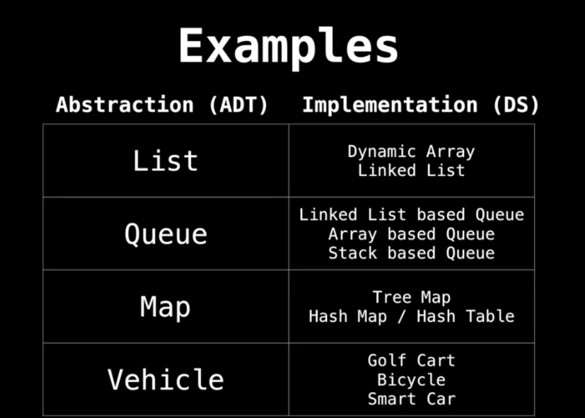

# Data Structure

## What?

A data structure is a way of organizing data so that it can be used effectively.

## Why?

Essential for creating fast and powerful algorithms.
They help to manage and organize data.
They make code cleaner and easier to understand.

We have to try use appropriate the data structure for the given task.

## Abstract Data Type vs. Data Structures

An ADT is a way of defining a type of data and the operations that can be performed on it, without specifying how those operations are implemented.

For example,consider your ADT is for mode of transportation to get from point A to B. As we know there are many modes of transportation such as walking, biking etc.
So how did we get there is our Data Structure.

