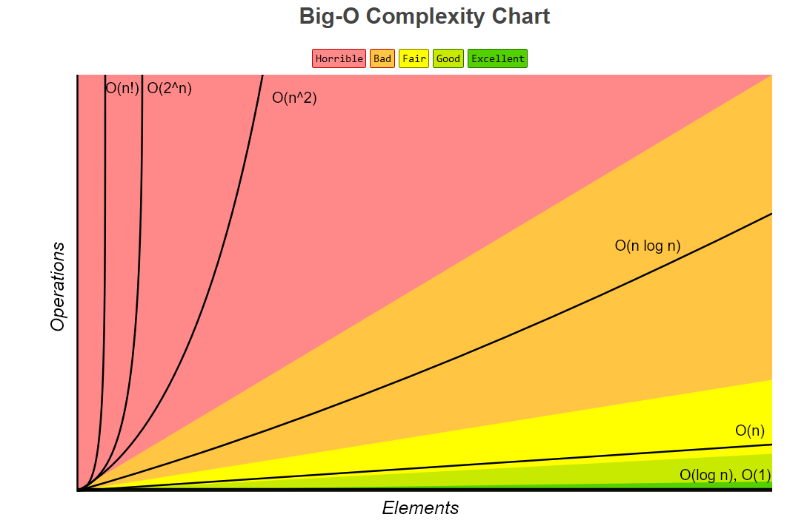

# Complexity Analysis

As programmers, we should know the following things
>
> - How much time does this algorithm needs to finish?
>
> - How much space does this algorithm need for its computation?
>

## Here comes MR. Big-O

It gives an upper bound of the complexity in the worst case.
n-The size of the input
>
> - Constant Time: O(1)
> - Logarithmic Time: O(log(n))
> - Linear Time: O(n)
> - Linearithemic Time: O(n log(n))
> - Quadric Time: O(n^2)
> - Cubic Time: O(n^2)
> - Exponential Time: O(b^n),b>1
> - Factorial Time: O(n!)

